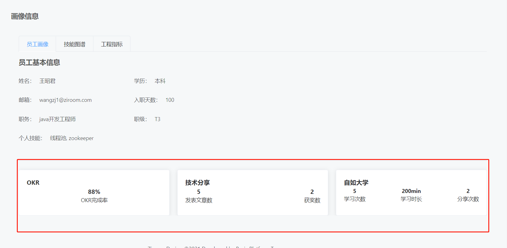
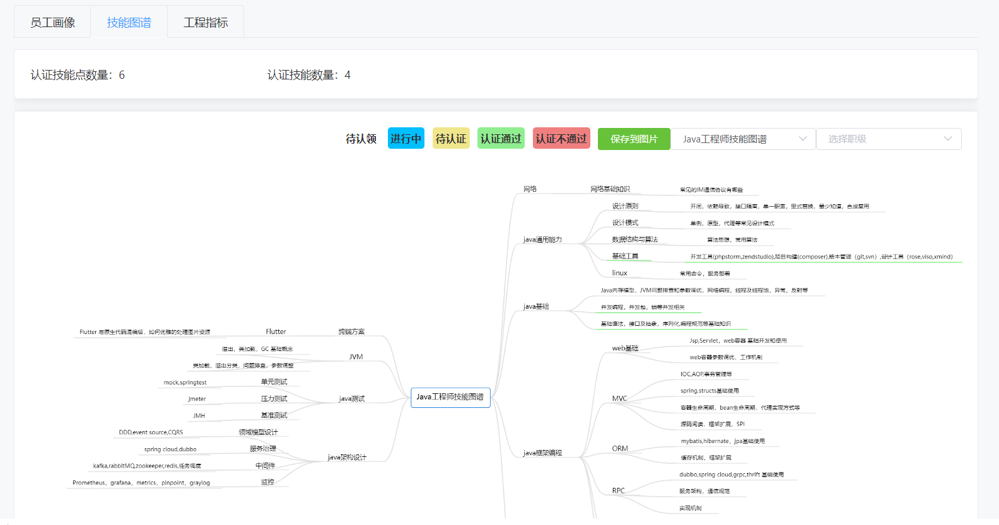
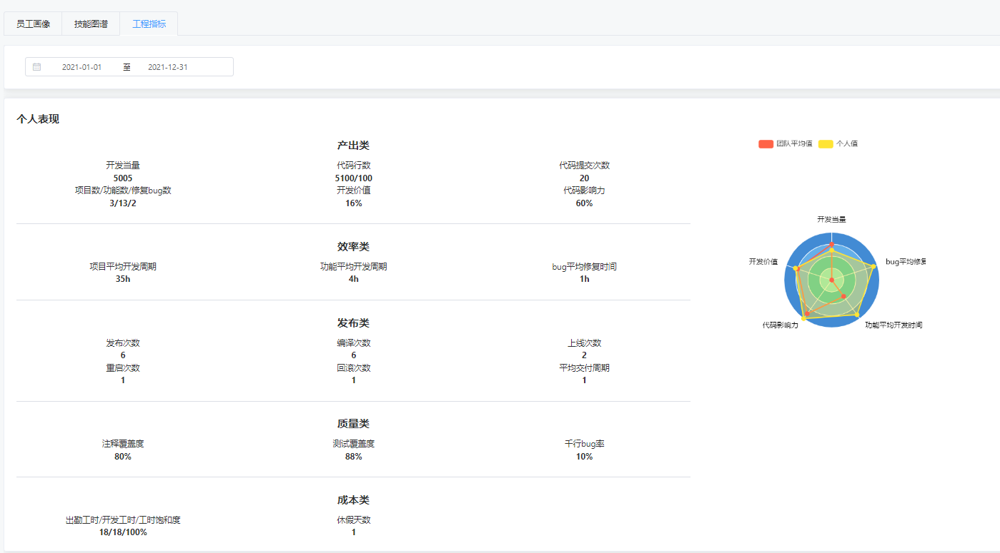
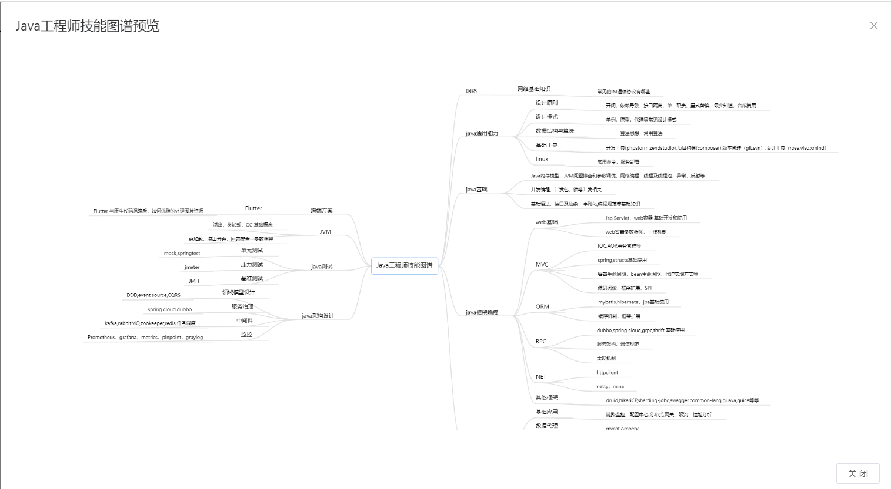
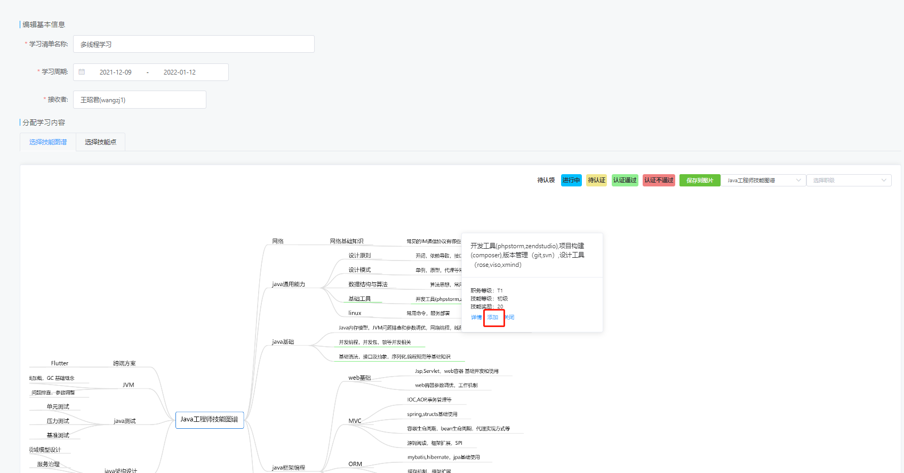
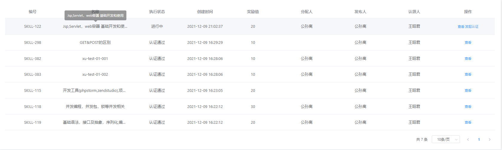
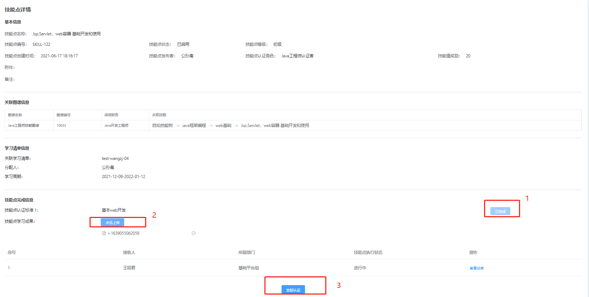
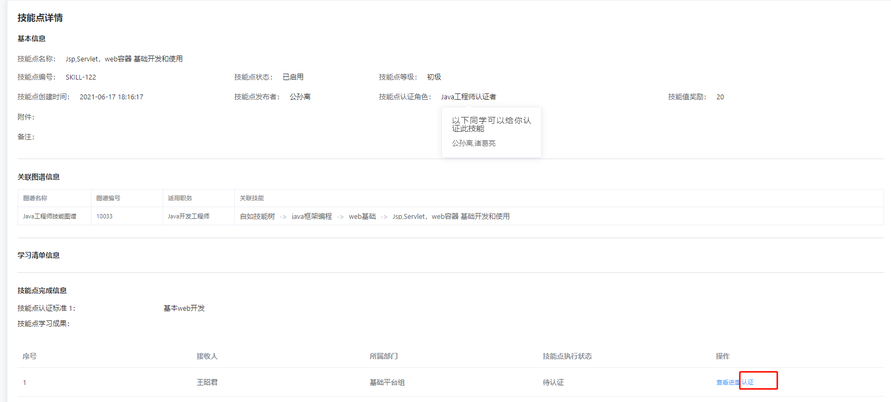
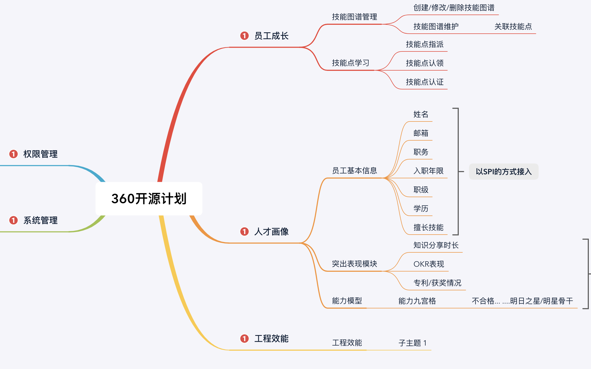

# demeter-api

## 友情提示
> 1. **快速体验项目**：暂未提供，运行项目请参照下文 [演示版本运行必须完成的事情] 板块，完成准备工作。参照 [项目运行] 模块运行项目。
> 2. **演示版本账号**：管理员账号: gongsl1 密码: 1  普通成员账号: wangzj1 密码: 1。
> 3. **前端项目地址**：[demeter-ui](https://github.com/ziroom-oss/demeter-ui)


## 前言

`demeter`项目致力于为员工提供全方位的自我成长平台，为研发赋能，采用现阶段流行技术实现。


## 项目介绍

`demeter`项目是一个人效平台，主要分为两个模块：研发赋能、画像管理。  
1. 研发赋能：旨在为员工提供自我成长的学习规划路径，利用技能图谱，任务指派，技能认证，提升员工自我硬实力。每个岗位都对应一颗技能树 员工通过自我学习技能，项目中应用技能(熟练度达标)可点亮技能点，技能树完成度可反映一个人技术水平，可以以此衡量一个人的能力。系统权限分为三个角色，最高管理员，部门管理者，普通员工。最高管理员，部门管理者可以创建技能图谱，创建技能点，指派学习任务。
2. 画像管理：分为员工个人画像和团队画像。画像是一个人工作的直观表现,画像中以多个维度指标衡量一个人工作的水平,可以此反应一个人工作的质量。


### 项目演示

#### 个人画像
##### 员工画像
分为员工基本信息和员工闪耀点两个板块。员工闪耀点板块可根据实际情况动态改变



##### 技能图谱
技能图谱由最高管理员或部门管理者创建，员工认领学习技能


##### 工程指标
员工个人工作展现，直观反应员工一段时间内的工作表现。


#### 研发赋能
##### 操作流程
部门管理者视角：完整流程。在技能树上添加技能->在技能上添加技能点->挑选技能点，创建技能图谱->挑选技能指派学习清单给员工->员工认领并完成技能->部门管理者验收->验收通过后，任务清单结束。可根据实际情况操作，如可以直接指派学习清单给员工。

普通员工视角：认领技能清单->完成技能->领导验收->验收成功点亮技能图谱
##### 创建技能图谱
部门管理者创建技能图谱


##### 部门管理者指派学习清单
部门管理者为职工指派学习任务


##### 员工认领学习清单



##### 部门管理者验收
部门管理者验收员工学习成果，验收通过后，点亮员工的技能图谱



### 演示版本运行必须完成的事情
```lua
├── 数据库 -- 1. 创建数据库(mysql版本 5.7之后版本 支持多个timestamp)   2. 执行 demeter-create.sql, demeter-init.sql 导入数据   3. 修改 application-test.properties 数据库配置 
```
### 项目运行需要完成的事情
```lua
├── 后端 -- 执行 [演示版本运行必须完成的事情] 后，直接启动即可
├── 前端 -- 1. npm insall   2. npm start 具体参照 [传送门](https://github.com/ziroom/demeter-ui/README.md) 中 [搭建步骤] 模块
```
### 正式使用需要完成的事情(根据需要酌情替换)

``` lua
├── 员工画像 -- 完成数据指标的采集分析,根据本系统提供的数据模型 采集指标 定时同步数据指标, 此系统仅提供数据展示能力(演示版 有静态数据提供)。
├── 用户中心 -- 使用者自行实现，演示版 有本地服务提供, 用户中心参见 EhrServiceClient.class 
├── 消息中心 -- 使用者自行实现，演示版 有本地服务提供, 消息中心参见  ConsoleSendHandler.class
├── 文件中心 -- 使用者自行实现，演示版 有本地服务提供, 文件中心参见 FileService.class 演示版本当前仅支持文本格式文件
├── 权限中心 -- 权限中心参见 AuthService.class 用户接入根据需要替换
├── 缓存配置 -- 演示版本有本地缓存提供。使用者若想接入需替换缓存，配置文件中更改redis缓存地址,  可根据需要修改 RedisFacade.class
├── 环境隔离 -- 当前系统分为 dev环境 和 test环境，演示版本为test环境，正式使用时替换为 dev环境
```

### 架构设计


##### 业务架构图



#### 工程指标解读
开发当量：衡量开发者修改代码的工作量的指标
代码影响力：综合开发当量和函数调用关系,影响力越大代表该提交或者该开发者贡献代码对整个项目代码库的影响越广。 开发者影响的函数数目/总函数数目
注释覆盖度：有注释的函数占项目中总函数个数的比例。  提交有注释函数数目/提交的总函数数目
测试覆盖度计算：被测试函数覆盖的函数占项目中非测试函数总数比例。  被测试覆盖的函数数目/提交的总函数数目
工程质量：包括代码复用度、测试覆盖度、注释覆盖度、代码问题数等。
开发价值：综合了开发当量、开发影响力和工程质量的综合指数。  开发价值 = 代码影响力% + 开发当量% + 代码质量% + 测试覆盖度% + 注释覆盖度%
工作饱和度：开发工时/出勤工时
千行bug率计算：

#### 接入指南
##### 工程指标数据接入指南
1. 代码提交记录分析报告快照表(ca_commit_report), 开发者每次提交都生成一条分析记录快照，开发价值 代码影响力指标 实时变动性强 为方便后面的统计准确性 1. 可定时刷新分析记录,更新保存的开发价值, 影响函数数目等指标 2. 也可在用到的时候实时从源数据提取计算
2.  开发者工作体现分析报告表(ca_commit_report), 多个维度指标的聚合,统计开发者时间区间的表现,以天为单位生成开发者分析报告
3. 开发者成长画像记录表(demeter_person_growingup), 该表存储开发者的成长表现. 注：同一标题 样式类型 必须相同


## 许可证

[Apache License 2.0](LICENSE)
